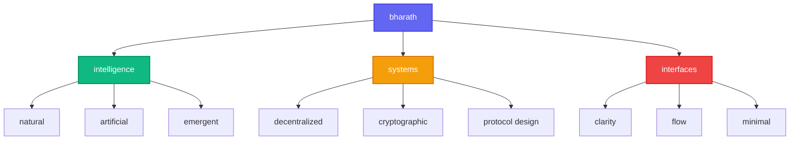

# bharath

*rewiring code, decoding thought*

---

### ✦ who i am

a computer science undergrad  
drawn to intelligence — natural, artificial, emergent  
i read, i build, i question defaults

 

---

### ✦ what excites me

🧠 intelligence & cognition

- llms, generative models, and AGI blueprints  
- philosophy of mind, cognition, and systems  
- reading things that break assumptions

🔗 decentralized systems

- decentralization, cryptographic trust, protocol design  
- building interfaces for clarity and flow

---

### ✦ what i'm building

<table>
<tr>
<td width="50%">

**avalon**  
*a calm interface for academic chaos*

</td>
<td width="50%">

**parking vision**  
*lightweight spatial awareness from a static camera*

</td>
</tr>
<tr>
<td width="50%">

**dark web monitor**  
*passive AI that listens for digital danger*

</td>
<td width="50%">

**[ thinking... ]**  
*next project materializing*

</td>
</tr>
</table>

---

### ✦ current mental state

---

### ✦ mind map

---

### ✦ digital presence

*currently:* `thinking • building • questioning`

---

---

*"the question is not what you look at, but what you see"*  
— henry david thoreau

