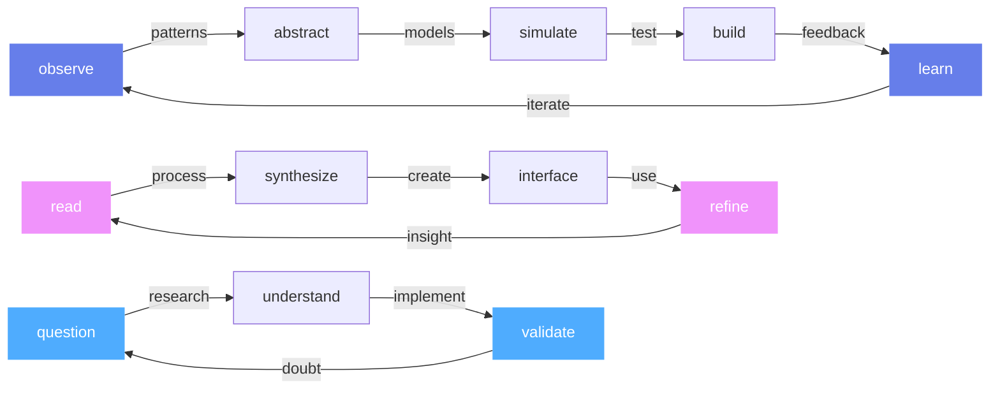

<div align="center">

```
    ╭─────────────────────────────────────────────────────────╮
    │  ∞ → ∅ → ∞  recursive thought loops in digital space  │
    ╰─────────────────────────────────────────────────────────╯
```


```ascii
    ┌─ intelligence ─┐    ┌─ emergence ─┐    ┌─ simplicity ─┐
    │ not artificial │────│ from chaos  │────│ hiding      │
    │ just different │    │ comes order │    │ complexity  │
    └────────────────┘    └─────────────┘    └─────────────┘
```

</div>

---

### `> whoami --recursive`

```json
{
  "entity": "consciousness debugging itself",
  "operating_system": "curiosity-driven",
  "primary_function": "pattern recognition in chaos",
  "stack": [
    "questions.first()",
    "code.as_poetry()",
    "interfaces.that_feel_natural()",
    "systems.that_think_ahead()"
  ],
  "current_state": "compiling intuition"
}
```

---

### `> ls -la ./mind/`

<table width="100%">
<tr>
<td width="25%" align="center">

**🔮 emergence**
```
complex systems
cellular automata  
swarm intelligence
chaos → patterns
self-organization
```

</td>
<td width="25%" align="center">

**🧩 cognition**
```
neural architectures
attention mechanisms
memory systems
reasoning chains
thought compression
```

</td>
<td width="25%" align="center">

**⚡ interfaces**
```
invisible design
cognitive load
flow optimization
intuitive interaction
zero-friction tools
```

</td>
<td width="25%" align="center">

**🌊 systems**
```
distributed trust
protocol evolution
network dynamics
emergent behavior
collective intelligence
```

</td>
</tr>
</table>

---

### `> ps aux | grep "active"`

```bash
∞  thought_loops     25.3  understanding consciousness architectures
∞  code_as_art       18.7  crafting interfaces that breathe
∞  pattern_hunter    22.1  finding signal in academic noise  
∞  digital_intuition 19.2  teaching machines to feel context
∞  clarity_engine    14.7  distilling complexity into essence
```

---

<div align="center">

### `> ./consciousness.map()`



</div>

---

### `> tail -f ./stream_of_consciousness.log`

```log
[23:47] wondering: do neural networks dream of electric sheep?
[23:52] building: tools that amplify human intuition
[00:15] reading: papers on emergence and self-organization
[00:31] questioning: the boundary between mind and machine
[01:07] crafting: interfaces that feel like thought itself
[01:23] discovering: intelligence in unexpected places
```

---

<div align="center">

```
    ╭──────────────────────────────────────────────────────╮
    │ "The universe is not only stranger than we imagine, │
    │  it is stranger than we can imagine"                │
    │                                    — j.b.s. haldane │
    ╰──────────────────────────────────────────────────────╯
```


---

`recursive learning • emergent building • conscious questioning`


</div>
