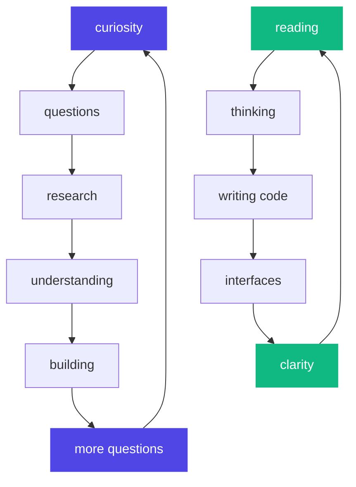

<div align="center">

```
    ██████╗ ██╗  ██╗ █████╗ ██████╗  █████╗ ████████╗██╗  ██╗
    ██╔══██╗██║  ██║██╔══██╗██╔══██╗██╔══██╗╚══██╔══╝██║  ██║
    ██████╔╝███████║███████║██████╔╝███████║   ██║   ███████║
    ██╔══██╗██╔══██║██╔══██║██╔══██╗██╔══██║   ██║   ██╔══██║
    ██████╔╝██║  ██║██║  ██║██║  ██║██║  ██║   ██║   ██║  ██║
    ╚═════╝ ╚═╝  ╚═╝╚═╝  ╚═╝╚═╝  ╚═╝╚═╝  ╚═╝   ╚═╝   ╚═╝  ╚═╝
```


[**8harath.me**](https://8harath.me) • [**github**](https://github.com/8harath)

</div>

---

<br>

<div align="center">

### `./whoami`

</div>

```yaml
identity:
  role: computer science undergrad
  interests: [intelligence, systems, emergence]
  approach: read → build → question → repeat

philosophy:
  - "intelligence is the universe understanding itself"
  - "code is crystallized thought"
  - "interfaces should feel like extensions of mind"
```

---

<div align="center">

### `./current_fascinations`

</div>

<table>
<tr>
<td width="33%" align="center">

**🧠 intelligence**
```
llms
generative models
AGI blueprints
philosophy of mind
cognitive architectures
```

</td>
<td width="33%" align="center">

**🔗 systems**
```
decentralization
cryptographic trust
protocol design
emergent behavior
network effects
```

</td>
<td width="33%" align="center">

**🎨 interfaces**
```
clarity over complexity
flow states
minimal friction
thoughtful interaction
human-centered design
```

</td>
</tr>
</table>

---

<div align="center">

### `./active_projects`

</div>

<br>

> **avalon**  
> *a calm interface for academic chaos*  
> `status: architecting the calm`

> **parking vision**  
> *lightweight spatial awareness from a static camera*  
> `status: teaching cameras to see`

> **dark web monitor**  
> *passive AI that listens for digital danger*  
> `status: building digital intuition`

<br>

---

<div align="center">

### `./mental_state`


</div>

---

<div align="center">

### `./thought_network`



</div>

---

<div align="center">

```
┌─────────────────────────────────────────┐
│  "the best way to understand a system   │
│   is to try to change it"               │
│                          — kurt lewin   │
└─────────────────────────────────────────┘
```

<sub>*always learning • always building • always questioning*</sub>


</div>
